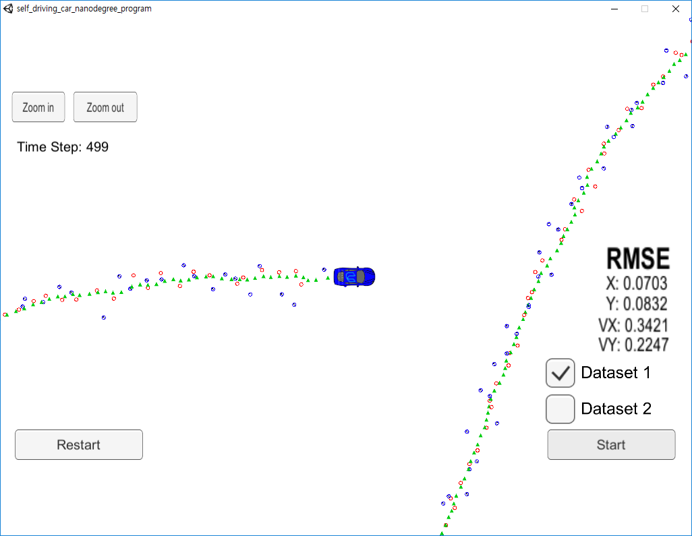

# **Unscented Kalman Filter**

## Goals
* Estimate the state of a vehicle with given radar and lidar data via UKF(Unscented Kalman Filter)

## Files
* README.md: this file
* CMakeLists.txt: cmake list file
* cmakepatch.txt: cmake patch file
* install-*.sh: scripts for installing uWebSockets
* data/*: radar and lidar data for a moving vehicle
* images/*: captured image file(s) for this markdown file
* src/*: source code to predict/update the state of a vehicle
* src/Eigen/*: Eigen library source

## Prerequisites
* cmake &ge; 3.5
* make &ge; 4.1 (Linux, Mac), 3.8 (Windows)
* gcc/g++ &ge; 5.4
* uWebSocketIO from [here](https://github.com/uNetworking/uWebSockets)
* *simulator* from [here](https://github.com/udacity/self-driving-car-sim/releases/)

## Test Method and Result
0. run install-*.sh for installing uWebSockets library
1. In the shell prompt, type **cmake**
2. Then type **make**
3. Run **./UnscentedKF**
4. Run simulator from another shell or file explorer!!
5. Select 1/2 project and start with ***Dataset1***
6. Result is as follows

